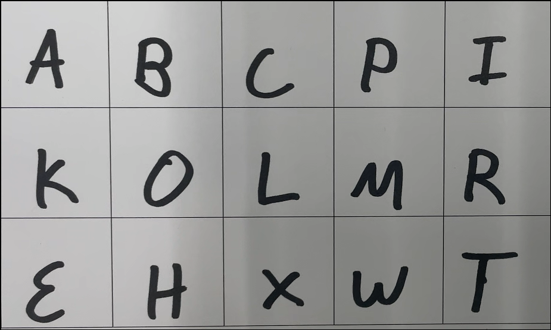
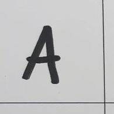
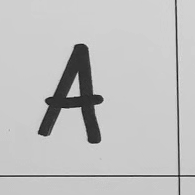
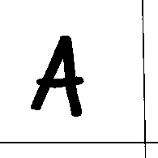
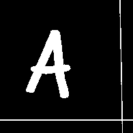
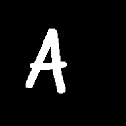
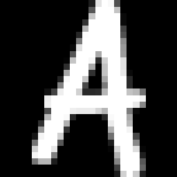
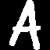

# Smart Systems Engineering Letters Dataset

This repository contains a dataset collected from the students in years 2020 and 2025, and currently accounts to a total of 2840 images. The images are divided in 15 classes, containing the letters shown below.

The dataset is constructed as follows and is currently available in 2 resolutions: `28 x 28` (MNIST style) and a slightly sharper `64 x 64`. 

## How do we process the images?

---

### Step 1
First thing that is always needed is an initial picture. In our case, I was scanning `5 x 3` grids of letters that some of you may remember filling out. After cropping the image, we get the following:

  

---

### Step 2
Now, we can divide the image into 15 squares, each containing exactly 1 letter. I will showcase the rest of the processing pipeline using the letter A as an example:

  

---

### Step 3
After cropping, we can now begin the proper processing. First, we convert the image to grayscale and then apply variable thresholding to binarize it. As you can see, at this point the outline of the letter is black on a white background. However, traditionally it is the white objects on a black background that are treated as BLOBs in most morphological operations, rather than the other way around. So we invert the pixel values of the image so that white pixels `(255, 255, 255)` become black `(0, 0, 0)` and black become white. Now we have a white BLOB roughly in the center of the image with a black background. You can observe the results of these operations below:

  
  
  

---

### Step 4
But we are not done yet! Sometimes because of imperfect cropping, some artifacts may appear on the image during processing. These artifacts may later cause wrong groups of neurons to activate during the CNN training and subsequently cause misclassifications. So naturally we would like to get rid of them. We can get rid of small artifacts by opening an image. Just look at the before and after:

  
  

---

### Step 5
Now that we have a clear outline of the letter, we can further crop it to the bounding box of the remaining BLOB to get rid of inconsistent padding caused by letters being written in different parts of the initial bounding square. We also pad the image to make it square again:

  
  

---

### Step 6
As the final step, we resize the image to the smaller dimensions (`28x28` in this case) by taking the averages of several pixels (similar principle to the mean filter). To get rid of the "blurriness", we apply thresholding once more and obtain a final sharp image of the letter:

  
  

---

> [!Note] 
> You can find the entire code used for processing in `srcipts/readme-demo.py`.
